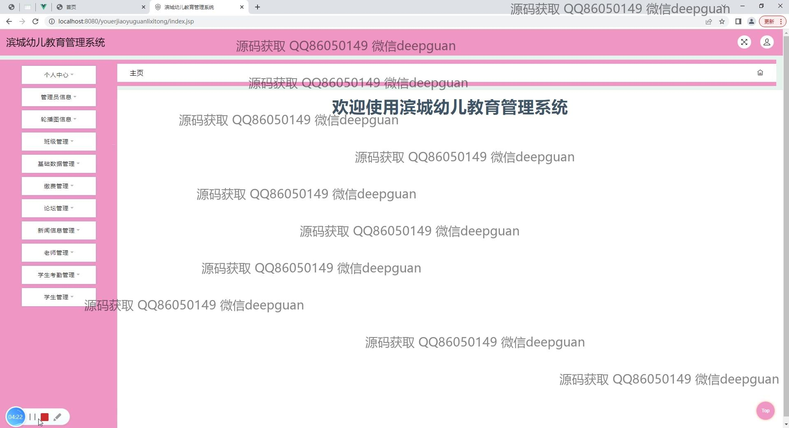

<h1 align="center">滨城幼儿教育管理系统的设计与实现</h1>

## 简介
滨城幼儿教育管理系统：角色分为管理员、用户；提供论坛管理、新闻信息管理、学生考勤、教师与学生信息管理、班级和缴费管理、用户信息管理等功能，界面设计简洁，适合幼儿教育主题。    --计算机毕业设计源码；毕设源码；java毕业设计源码

## 联系方式

<h3 align="center">获取完整代码与数据库文件 + 微信：deepguan QQ: 86050149 QQ群: 783742310</h3>

<h3 align="center">可帮忙远程部署 包运行成功！提供远程部署、修改代码、设计文档指导、代码讲解等服务！</h3>

## 功能介绍（完整见运行截图）
管理员： 登录、注册、退出功能；通过首页导航栏访问各模块，管理轮播图信息，班级管理，基础数据管理，教师管理，学生管理、考勤管理和论坛管理等；管理用户信息，包括查询、添加、编辑和删除用户；查看并更新学生和教师的信息，以及学生考勤记录；具有管理缴费类型和查看缴费记录的权限；支持对论坛发帖进行管理和审核。

教师： 登录、访问个人中心查看和修改个人信息；管理班级信息和学生考勤记录；可以在论坛中浏览和发布帖子，与学生和家长互动；查看、添加和修改教育资讯，并参与论坛讨论；负责录入、查看并管理学生的课程安排和考勤信息，确保学生考勤记录的准确性；提供对学生和家长的通知和沟通功能，便于协调管理班级事务。

学生： 登录、访问个人中心查看和修改个人信息；查看班级信息和个人的考勤记录；在论坛中查看、发布和管理自己的帖子，以及参与讨论；浏览教育新闻和信息；查看已缴费项目的详细信息，如缴费类型、状态和金额；访问新闻资讯模块获取相关信息，参与校园内活动和交流。

家长： 注册、登录查看孩子的考勤记录和科目信息；访问个人中心修改个人和孩子的信息；在论坛模块中发布和查看帖子，与其他家长和老师交流；查看新闻信息和教育资讯，了解学校活动和政策；管理和查看孩子的缴费记录，核对缴费状态和金额；接收学校通知和公告，与教师进行及时沟通和反馈。

## 运行截图

本代码来源于网络,仅供学习参考使用!

